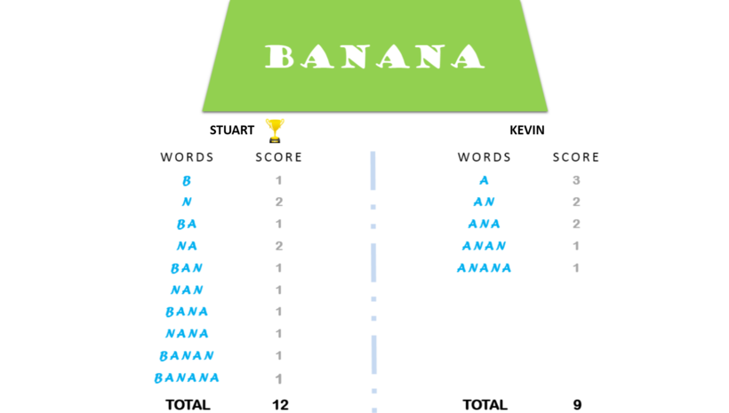

# Task

Kevin and Stuart want to play the 'The Minion Game'.

**Game Rules**

Both players are given the same string, **s**.
Both players have to make substrings using the letters of the string **s**.
Stuart has to make words starting with consonants.
Kevin has to make words starting with vowels.
The game ends when both players have made all possible substrings.

**Scoring**
A player gets +1 point for each occurrence of the substring in the string **s**.

**For Example:**
String
s = BANANA
Kevin's vowel beginning word = ANA
Here, ANA occurs twice in BANANA. Hence, Kevin will get 2 Points.

For better understanding, see the image below: 

Your task is to determine the winner of the game and their score.

# Function Description

Complete the minion_game in the editor below.

minion_game has the following parameters:

    string: the string to analyze

**Return**

    string: the winner's name and score, separated by a space on one line, or Draw if there is no winner

# Input Format

A single line of input containing the string **s**.
Note: The string will contain only uppercase letters: [A - Z]

# Sample Input

    BANANA

# Sample Output

    Stuart 12

Note :
Vowels are only defined as AEIOU. In this problem, Y is not considered a vowel.